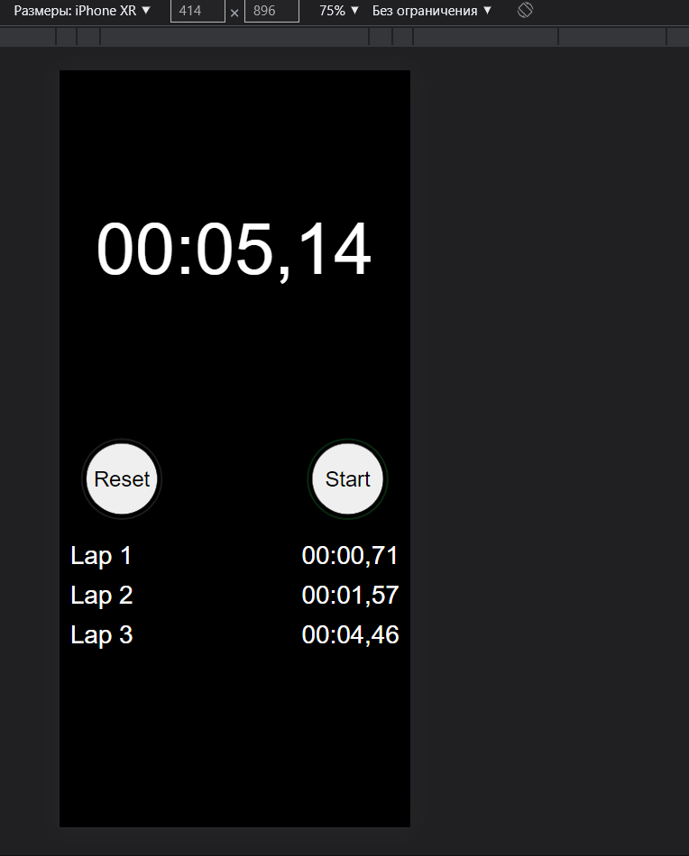

### ❗watch in developer mode (iphone xs)❗ ❗смотреть в режиме разработчика(iphone xs)❗

# Stopwatch (en) - 
 
## this is my first stopwatch made. The interface is iPhone, I think you will like it, if so, put star

# What is it for?

## I hope that I helped you, because everyone needs a stopwatch, for example, if you're doing homework or programming, set a timer for an hour, and when that hour passes, you can rest after that. 

# Interface:

 

# For all your questions - to contact me: 

# Stopwatch(ru):

## это мой первый сделанный секундомер. Интерфейс  айфоновский, думаю, вам понравится, если да, то поставьте star

# Для чего он нужен? 

## я надеюсь, что я вам помогла, потому что секундомер нужен каждому человеку, к примеру, если ты делаешь уроки или занимаешься программированием - поставь себе таймер, к примеру, на час, а когда этот час пройдет, то можешь после этого отдохнуть. 

# Интерфейс:

 
# Ко всем вопросам обращайтесь: 

##### ❗идея данного проекта зародилась благодаря ролику в YouTube❗ ❗ The idea for this project came from a YouTube video❗
